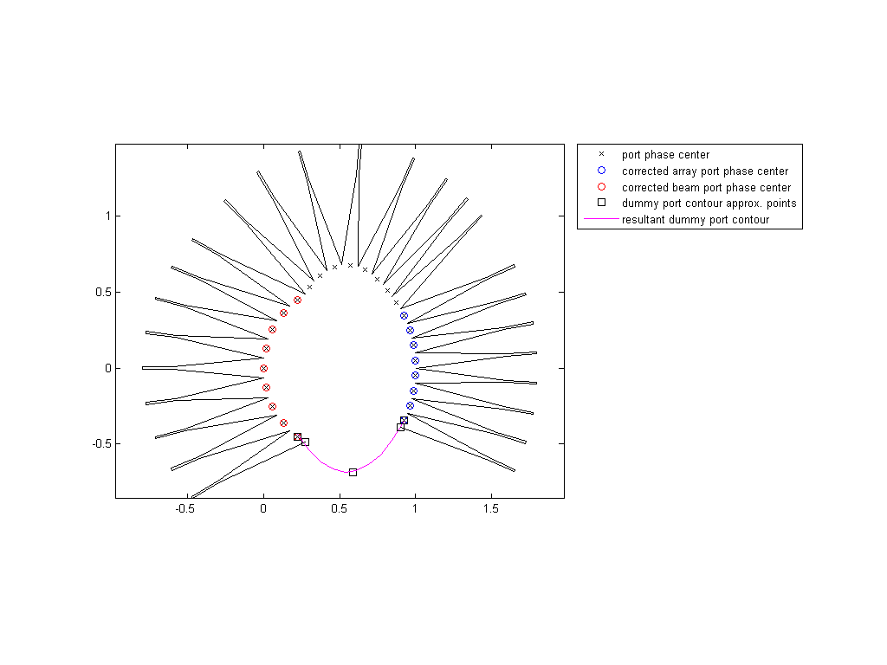
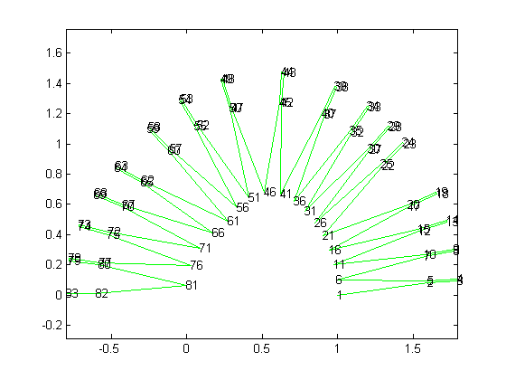
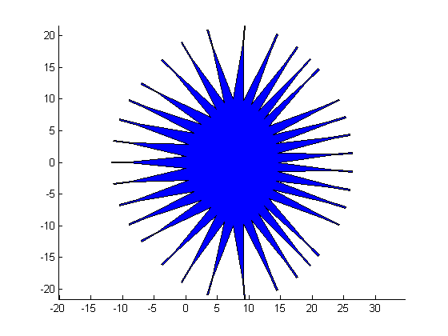

# Rotman Lens design and visualization

This script generates a planar polygon with N vertices defined by coordinate vectors X and Y. Polygon represents the contour of the planar Rotman Lens (RL) based on the user defined input parameters. RL port phase centers are obtained by the evaluation of the formulas published by Peter S. Simons, 2004.

All dimensions are in meters and angles in radians.

## Contents

* [ACKNOWLEDGEMENT](#1)
* [Init](#4)
* [Basic input parameters](#5)
* [Antenna elememt spacing](#6)
* [Transmission lines and transitions definition](#7)
* [Dummy port contour parameters](#8)
* [Array and Beam ports phase center correction](#9)
* [Evaluations](#10)
* [Beam port geometry generation](#11)
* [Array port geometry generation](#12)
* [Dummy port geometry generation](#13)
* [Visualization of RL contour and specific points in normalised scale [1/f1]](#14)
* [Visualization of RL vertices numbering in normalized scale [1/f1]](#15)
* [Visualization of RL in real scale [mm] for target Er](#16)
* [Outputs](#17)
## ACKNOWLEDGEMENT

If you've found this code useful for your work, indicate the authors in your publications please:


```
Dr.Michal Pokorny [pokorny.michal@seznam.cz]
Prof. Zbynek Raida [raida@feec.vutbr.cz]
```

```
SIX Research Center
Brno University of Technology
Technická 12
CZ-616 00 Brno
Czech Republic
```
## Init


```
close all;
clear all;
clc

```
## Basic input parameters


```
%input set 1
v0=299792458;   %[m/s] speed of light
f=60e9;         %[Hz] design frequency
lambda0=v0/f;   %[m] wavelength in vacuum
Er=2.9;         %[-] relative permittivity of dielectric substrate

%input set 2
Nb=9;           %number of the beam ports
Na=8;           %number of the array ports
Nd=8;           %[1 2 4 8] only possible number of the dummy ports,
theta = 30;     %[deg] Array steering angles
alpha = 30;     %[deg] Focal angle
beta = 0.90;    %Focal ration f2/f1
gamma = 1.00;   %Expansion factor sin(phi)/sin(alpha)
f1=5*lambda0;   %On-axis focal length

```
## Antenna elememt spacing


```
% sd=1/(1+sin(pi*50/180)); %[lambda0] maximal array antenna elements
                            %spacing preventing to form the gratin lobes
sd=0.5;                     %[lambda0]array antenna elements spacing
d=sd*lambda0;               %[m]array antenna elements spacing

```
## Transmission lines and transitions definition


```
ww=0.00021; %[m] transmission line width. Put here the target width of your
            %microstrip line or SIW line connected to the ports
Ww=ww*sqrt(Er); %rescaling for vacuum Er=1;
Lw=lambda0;     %[m]length of the transmission lines (TL)

Lbp=3*lambda0;  %[m]length of taper transition from RL region to TL at BEAM ports
Lap=3*lambda0;  %[m]length of taper transition from RL region to TL at ARRAY ports
Ldp=3*lambda0;  %[m]length of taper transition from RL region to TL at DUMMY ports

```
## Dummy port contour parameters


```
lw=1.4; %lens width relative to the total array ports or beam ports area width
pd=2;   %polynom degree for the dummy port contour approximation
td=0.8; %relative deviation of the dummy port longitudinal axis from lens contour normal

```
## Array and Beam ports phase center correction


```
PhCC=3; %select your option
% 1 ~ Correction based on E.I. Muehldorf 1970, IEEE Tran. on Antennas and Prop.
% 2 ~ Correction based on approximation of CST and HFSS calculations
% 3 ~ No correction
% 4 ~ Manually specified correction PhCCx:
PhCCb = 0.001; %[m] beam ports phase center correction
PhCCa = 0.001; %[m] array ports phase center correction

```
## Evaluations


```
%auxiliary parameters
theta = linspace(-2*pi*theta/360,2*pi*theta/360,Nb);
alpha = 2*pi*alpha/360;
y3=(1:1:Na)*d-(Na+1)*d/2; %location of the array elements along array axis
W0=0.005/f1; %ofset length of TEM cables
zeta=y3*gamma/f1;
rho0 = 1-(1-beta^2)/(2*(1-beta*cos(alpha)));
alphaN = asin(sin(theta)/gamma);
phi = asin(((1-rho0)/rho0)*sin(alphaN));

%calculation of the normalized length w of TEM cable, w/f1
a = 1-(1-beta)^2/(1-beta*cos(alpha))^2-(zeta.^2/beta^2);
b = -2+2*zeta.^2./beta + 2*(1-beta)/(1-beta*cos(alpha))-zeta.^2.*sin(alpha)^2*(1-beta)/(1-beta*cos(alpha)^2);
c = -zeta.^2 + zeta.^2.*sin(alpha)^2/(1-beta*cos(alpha)) - zeta.^4.*sin(alpha)^4/(4*(1-beta*cos(alpha))^2);
W=-(b+sqrt(b.^2-4.*a.*c))./(2*a);

% array port phase center NORMALIZED coordinates
Xa=1-((0.5*zeta.^2*sin(alpha)^2+(1-beta).*W)./(1-beta*cos(alpha)));
Ya=zeta.*(1-W./beta);

% beam port phase center NORMALIZED coordinates
Xb=rho0*(1-cos(alphaN+phi));
Yb=rho0*sin(alphaN+phi);

```
## Beam port geometry generation


```
alphaC=atan(Yb./(rho0-Xb)); %angles from the center of the beam port arc
deltaB=atan(Yb./(1-Xb));  %angles from the center of array curve

Wp=sqrt((Xb(1)-Xb(2))^2+(Yb(1)-Yb(2))^2)/cos((alphaC(1)-alphaC(2))/2); %Aperture width, (will be corrected due to non uniform aperture widths)
Wp=Wp*f1; %Unnormalization. Wp was calculated from normalized coordinates

%Evaluation of the phase shift deviation Lph from aperture center
Rh=sqrt(((Wp+Ww)/2)^2+Lbp^2);
S=Wp^2/(8*lambda0*Rh);

 switch PhCC
   case 1
     if S>0.06 %approximations are not valid below S=0.06
       Lph=(2.6746*S.^2 + 0.2026*S - 0.0085)*Rh; %approximation of the Lph from E.I. Muehldorf 1970, IEEE Tran. on Antennas and Prop.
     else
      Lph=0;
     end;
   case 2
     if S>0.06 %approximations are not valid below S=0.06
       Lph=( -454.9955*S.^6 +  837.7860*S.^5 - 556.1810*S.^4 + 147.3046*S.^3 - 9.4030*S.^2 + 0.3223*S)*Rh;%approximation of the Lph based on CST and HFSS calculations
     else
       Lph=0;
     end;
   case 3
    Lph=0;
   case 4
    Lph=PhCCb;
   otherwise
    Lph=0;
 end

%new coordinates of the beam ports, shifted phase center by Lph
Xb0=Xb+cos(deltaB)*Lph/f1;
Yb0=Yb-sin(deltaB)*Lph/f1;

XbN=Xb0-cos(deltaB)*Lbp/f1;
YbN=Yb0+sin(deltaB)*Lbp/f1;
XbNN=Xb0-cos(deltaB)*(Lbp+Lw)/f1;
YbNN=Yb0+sin(deltaB)*(Lbp+Lw)/f1;

Xb1=Xb0+sin(alphaC)*Wp/2/f1;
Yb1=Yb0+cos(alphaC)*Wp/2/f1;
Xb2=Xb0-sin(alphaC)*Wp/2/f1;
Yb2=Yb0-cos(alphaC)*Wp/2/f1;

Xb3=XbN+sin(deltaB)*Ww/2/f1;
Yb3=YbN+cos(deltaB)*Ww/2/f1;
Xb4=XbN-sin(deltaB)*Ww/2/f1;
Yb4=YbN-cos(deltaB)*Ww/2/f1;

Xb5=XbNN+sin(deltaB)*Ww/2/f1;
Yb5=YbNN+cos(deltaB)*Ww/2/f1;
Xb6=XbNN-sin(deltaB)*Ww/2/f1;
Yb6=YbNN-cos(deltaB)*Ww/2/f1;

for i=1:1:length(Xb)-1 %correction for the aperture width
centerX(i)=(Xb2(i+1)+Xb1(i))/2;
centerY(i)=(Yb2(i+1)+Yb1(i))/2;
Xb2(i+1)=centerX(i);
Xb1(i)=centerX(i);
Yb2(i+1)=centerY(i);
Yb1(i)=centerY(i);
end;

```
## Array port geometry generation


```
%repeat the array port calculation of intervaley coordinates
Na0=Na-1;
y30=(1:1:Na0)*lambda0/2-(Na0+1)*lambda0/4;
zeta0=y30*gamma/f1;
a0 = 1-(1-beta)^2/(1-beta*cos(alpha))^2-(zeta0.^2/beta^2);
b0 = -2+2*zeta0.^2./beta + 2*(1-beta)/(1-beta*cos(alpha))-zeta0.^2.*sin(alpha)^2*(1-beta)/(1-beta*cos(alpha)^2);
c0 = -zeta0.^2 + zeta0.^2.*sin(alpha)^2/(1-beta*cos(alpha)) - zeta0.^4.*sin(alpha)^4/(4*(1-beta*cos(alpha))^2);
W00=-(b0+sqrt(b0.^2-4.*a0.*c0))./(2*a0);

Xaa=1-((0.5*zeta0.^2*sin(alpha)^2+(1-beta).*W00)./(1-beta*cos(alpha)));
Yaa=zeta0.*(1-W00./beta);
%those coordinates gives the tangent angle to the port

alphaC0=atan(diff(Yaa)./diff(Xaa));
alphaC1=[0 alphaC0 0];

Wpa=sqrt((Xa(1)-Xa(2))^2+(Ya(1)-Ya(2))^2);
Wpa=Wpa*f1;

Law=Lw;
Wwa=Ww;

Xa1=Xa-cos(alphaC1)*Wpa/2/f1;
Ya1=Ya-sin(alphaC1)*Wpa/2/f1;

alphaC2=atan((Ya1(2)-Ya(1))/(Xa1(2)-Xa(1)));
alphaC1=[alphaC2 alphaC0 -alphaC2];

%Evaluation of the phase shift deviation Lph from aperture center
Rha=sqrt(((Wpa+Wwa)/2)^2+Lap^2);
Sa=Wpa^2/(8*lambda0*Rha);

 switch PhCC
   case 1
     if Sa>0.06 %approximations are not valid below S=0.06
       Lpha=(2.6746*S.^2 + 0.2026*S - 0.0085)*Rh; %approximation of the Lph from E.I. Muehldorf 1970, IEEE Tran. on Antennas and Prop.
     else
       Lpha=0;
     end;
   case 2
     if Sa>0.06 %approximations are not valid below S=0.06
       Lpha=( -454.9955*S.^6 +  837.7860*S.^5 - 556.1810*S.^4 + 147.3046*S.^3 - 9.4030*S.^2 + 0.3223*S)*Rh;%approximation of the Lph based on CST and HFSS calculations
     else
       Lpha=0;
     end;
   case 3
    Lpha=0;
   case 4
    Lpha=PhCCa;
   otherwise
    Lpha=0;
 end

%new coordinates of the beam ports, shifted phase center by Lph
for i=1:1:length(Xa)
    if alphaC1(i)>0
        Xa0(i)=Xa(i)-sin(alphaC1(i))*Lpha/f1;
        Ya0(i)=Ya(i)+cos(alphaC1(i))*Lpha/f1;
    else
        Xa0(i)=Xa(i)+sin(alphaC1(i))*Lpha/f1;
        Ya0(i)=Ya(i)-cos(alphaC1(i))*Lpha/f1;

    end
end

Xa1=Xa0-cos(alphaC1)*Wpa/2/f1;
Ya1=Ya0-sin(alphaC1)*Wpa/2/f1;
Xa2=Xa0+cos(alphaC1)*Wpa/2/f1;
Ya2=Ya0+sin(alphaC1)*Wpa/2/f1;

deltaB0=alphaC1; % angle to axis of the array port; tangent to the lens contour

for i=1:1:length(Xa)
    if deltaB0(i)>0
        XaN(i)=Xa0(i)+sin(deltaB0(i))*Lap/f1;
        YaN(i)=Ya0(i)-cos(deltaB0(i))*Lap/f1;
        XaNN(i)=Xa0(i)+sin(deltaB0(i))*(Lap+Law)/f1;
        YaNN(i)=Ya0(i)-cos(deltaB0(i))*(Lap+Law)/f1;
    else
        XaN(i)=Xa0(i)-sin(deltaB0(i))*Lap/f1;
        YaN(i)=Ya0(i)+cos(deltaB0(i))*Lap/f1;
        XaNN(i)=Xa0(i)-sin(deltaB0(i))*(Lap+Law)/f1;
        YaNN(i)=Ya0(i)+cos(deltaB0(i))*(Lap+Law)/f1;
    end
end

deltaB0=pi/2-alphaC1;
Xa3=XaN-sin(deltaB0)*Wwa/2/f1;
Ya3=YaN-cos(deltaB0)*Wwa/2/f1;
Xa4=XaN+sin(deltaB0)*Wwa/2/f1;
Ya4=YaN+cos(deltaB0)*Wwa/2/f1;

Xa5=XaNN-sin(deltaB0)*Wwa/2/f1;
Ya5=YaNN-cos(deltaB0)*Wwa/2/f1;
Xa6=XaNN+sin(deltaB0)*Wwa/2/f1;
Ya6=YaNN+cos(deltaB0)*Wwa/2/f1;

for i=2:1:length(Xa)-1 %correction for the aperture width
        if alphaC1(i)>0
       centerXa(i)=(Xa2(i-1)+Xa1(i))/2;
       centerYa(i)=(Ya2(i-1)+Ya1(i))/2;
       Xa2(i-1)=centerXa(i);
       Xa1(i)=centerXa(i);
       Ya2(i-1)=centerYa(i);
       Ya1(i)=centerYa(i);
    else

  centerXa(i)=(Xa2(i+1)+Xa1(i))/2;
  centerYa(i)=(Ya2(i+1)+Ya1(i))/2;
  Xa2(i+1)=centerXa(i);
  Xa1(i)=centerXa(i);
  Ya2(i+1)=centerYa(i);
  Ya1(i)=centerYa(i);
        end

    if(~mod(Na,2))
         i=floor(Na/2);
         centerXa0=(Xa2(i+1)+Xa2(i))/2;
         centerYa0=(Ya2(i+1)+Ya2(i))/2;
         Xa2(i+1)=centerXa0;
         Xa2(i)=centerXa0;
         Ya2(i+1)=centerYa0;
         Ya2(i)=centerYa0;
    else
                i=floor(Na/2);
         centerXa0=(Xa2(i+1)+Xa2(i+2))/2;
         centerYa0=(Ya2(i+1)+Ya2(i+2))/2;
         Xa2(i+1)=centerXa0;
         Xa2(i+2)=centerXa0;
         Ya2(i+1)=centerYa0;
         Ya2(i+2)=centerYa0;
    end;

end;

```
## Dummy port geometry generation


```
Xp=[Xb0(1) Xb2(1)  (Xb2(1)+Xa1(1))/2  Xa1(1) Xa0(1)];
Yp=[Yb0(1) Yb2(1)  min(Yb2(1),Ya1(1))*lw Ya1(1) Ya0(1)]; %Approximation points
p = polyfit(Xp,Yp,pd);
Xd= linspace(Xb0(1),Xa0(1),10);
Yd=polyval(p,Xd);

XA=Xb2(1);
YA=Yb2(1);
XC=Xa1(1);
YC=Ya1(1);

 switch Nd
   case 1
      Xd0=[XA XC];
      Yd0=-[YA YC];
   case 2
      [XB, YB ]=equicenter(XA, YA, XC, YC, p);
      Xd0=[XA XB XC];
      Yd0=-[YA YB YC];
   case 4
      [XB, YB ]=equicenter(XA,YA,XC,YC,p);
      [XBN, YBN ]=equicenter(XA,YA,XB,YB,p);
      [XBNN, YBNN ]=equicenter(XB,YB,XC,YC,p);
      Xd0=[XA XBN XB XBNN XC];
      Yd0=-[YA YBN YB YBNN YC];
   case 8
      [XB, YB ]=equicenter(XA,YA,XC,YC,p);
      [XBN, YBN ]=equicenter(XA,YA,XB,YB,p);
      [XBNN, YBNN ]=equicenter(XB,YB,XC,YC,p);
      [XBNM, YBNM ]=equicenter(XA,YA,XBN,YBN,p);
      [XBNMM, YBNMM ]=equicenter(XBN,YBN,XB,YB,p);
      [XBNNM, YBNNM ]=equicenter(XB,YB,XBNN,YBNN,p);
      [XBNNMM, YBNNMM ]=equicenter(XBNN,YBNN,XC,YC,p);
      Xd0=[XA, XBNM, XBN, XBNMM, XB, XBNNM, XBNN, XBNNMM, XC];
      Yd0=-[YA, YBNM, YBN, YBNMM, YB, YBNNM, YBNN, YBNNMM, YC];
   otherwise
      Xd0=[XA XC];
      Yd0=-[YA YC];
 end

for i=1:1:length(Xd0)-1
  Xd0c(i)=(Xd0(i)+Xd0(i+1))/2;
  Yd0c(i)=(Yd0(i)+Yd0(i+1))/2;
end

alphaD=-atan(diff(Yd0)./diff(Xd0));
Ldw=Lw;
Wwd=Ww;

alphaD=alphaD*td;
XdN=Xd0c+sin(alphaD)*Ldp/f1;
YdN=Yd0c+cos(alphaD)*Ldp/f1;
XdNN=Xd0c+sin(alphaD)*(Ldp+Ldw)/f1;
YdNN=Yd0c+cos(alphaD)*(Ldp+Ldw)/f1;

for i=1:1:Nd
Xd1(i)=Xd0(i);
Yd1(i)=Yd0(i);
Xd2(i)=Xd0(i+1);
Yd2(i)=Yd0(i+1);
end


Xd3=XdN-cos(alphaD)*Wwd/2/f1;
Yd3=YdN+sin(alphaD)*Wwd/2/f1;
Xd4=XdN+cos(alphaD)*Wwd/2/f1;
Yd4=YdN-sin(alphaD)*Wwd/2/f1;

Xd5=XdNN-cos(alphaD)*Wwd/2/f1;
Yd5=YdNN+sin(alphaD)*Wwd/2/f1;
Xd6=XdNN+cos(alphaD)*Wwd/2/f1;
Yd6=YdNN-sin(alphaD)*Wwd/2/f1;
%remove the border points, they are duplicate to curve points

Xd=Xd(1:length(Xd));
Yd=Yd(1:length(Yd));

```
## Visualization of RL contour and specific points in normalised scale [1/f1]


```
figure('Position',[1 1 1024 768])

plot(Xd0c,Yd0c,'kx');
hold on;

plot(Xa,Ya,'bo');
plot(Xb,Yb,'ro')

plot(Xp, Yp,'ks')
plot(Xd,Yd,'m-')

plot(Xa1(1),Ya1(1),'ks')
plot(Xa0,Ya0,'kx')
plot(Xb0,Yb0,'kx')

j=1;
for i=length(Xd1):-1:1
plot([Xd2(i) Xd4(i) Xd6(i) Xd5(i) Xd3(i) Xd1(i)],[Yd2(i) Yd4(i) Yd6(i) Yd5(i) Yd3(i) Yd1(i)],'k-')
Xn((j-1)*6+1:j*6)=[Xd2(i) Xd4(i) Xd6(i) Xd5(i) Xd3(i) Xd1(i)];
Yn((j-1)*6+1:j*6)=[Yd2(i) Yd4(i) Yd6(i) Yd5(i) Yd3(i) Yd1(i)];
j=j+1;
end;

for i=length(Xb):-1:1
plot([Xb2(i) Xb4(i) Xb6(i) Xb5(i) Xb3(i) Xb1(i)],[Yb2(i) Yb4(i) Yb6(i) Yb5(i) Yb3(i) Yb1(i)],'k-')
Xn((j-1)*6+1:j*6)=[Xb1(i) Xb3(i) Xb5(i) Xb6(i) Xb4(i) Xb2(i)];
Yn((j-1)*6+1:j*6)=[Yb1(i) Yb3(i) Yb5(i) Yb6(i) Yb4(i) Yb2(i)];
j=j+1;
end;

for i=1:1:length(Xd1)
plot([Xd1(i) Xd3(i) Xd5(i) Xd6(i) Xd4(i) Xd2(i)],[Yd1(i) Yd3(i) Yd5(i) Yd6(i) Yd4(i) Yd2(i)],'k-')
Xn((j-1)*6+1:j*6)=[Xd1(i) Xd3(i) Xd5(i) Xd6(i) Xd4(i) Xd2(i)];
Yn((j-1)*6+1:j*6)=-[Yd1(i) Yd3(i) Yd5(i) Yd6(i) Yd4(i) Yd2(i)];
j=j+1;
end;

if(mod(Na,2))
  for i=1:1:floor(length(Xa)/2)+1
    plot([Xa2(i) Xa4(i) Xa6(i) Xa5(i) Xa3(i) Xa1(i)],[Ya2(i) Ya4(i) Ya6(i) Ya5(i) Ya3(i) Ya1(i)],'k-')
    Xn((j-1)*6+1:j*6)=[Xa1(i) Xa3(i) Xa5(i) Xa6(i) Xa4(i) Xa2(i)];
    Yn((j-1)*6+1:j*6)=[Ya1(i) Ya3(i) Ya5(i) Ya6(i) Ya4(i) Ya2(i)];
    j=j+1;
  end;

  for i=floor(length(Xa)/2)+2:1:length(Xa)
    plot([Xa2(i) Xa4(i) Xa6(i) Xa5(i) Xa3(i) Xa1(i)],[Ya2(i) Ya4(i) Ya6(i) Ya5(i) Ya3(i) Ya1(i)],'k-')
    Xn((j-1)*6+1:j*6)=[Xa2(i) Xa4(i) Xa6(i) Xa5(i) Xa3(i) Xa1(i)];
    Yn((j-1)*6+1:j*6)=[Ya2(i) Ya4(i) Ya6(i) Ya5(i) Ya3(i) Ya1(i)];
    j=j+1;
  end;
else
  for i=1:1:floor(length(Xa)/2)
    plot([Xa2(i) Xa4(i) Xa6(i) Xa5(i) Xa3(i) Xa1(i)],[Ya2(i) Ya4(i) Ya6(i) Ya5(i) Ya3(i) Ya1(i)],'k-')
    Xn((j-1)*6+1:j*6)=[Xa1(i) Xa3(i) Xa5(i) Xa6(i) Xa4(i) Xa2(i)];
    Yn((j-1)*6+1:j*6)=[Ya1(i) Ya3(i) Ya5(i) Ya6(i) Ya4(i) Ya2(i)];
    j=j+1;
  end;

  for i=floor(length(Xa)/2)+1:1:length(Xa)
    plot([Xa2(i) Xa4(i) Xa6(i) Xa5(i) Xa3(i) Xa1(i)],[Ya2(i) Ya4(i) Ya6(i) Ya5(i) Ya3(i) Ya1(i)],'k-')
    Xn((j-1)*6+1:j*6)=[Xa2(i) Xa4(i) Xa6(i) Xa5(i) Xa3(i) Xa1(i)];
    Yn((j-1)*6+1:j*6)=[Ya2(i) Ya4(i) Ya6(i) Ya5(i) Ya3(i) Ya1(i)];
    j=j+1;
  end;
end;
axis equal

%final coordinates
j=1;%remove duplicate coordinates
for i=1:1:length(Xn)-1
    if ~((Xn(i)==Xn(i+1))&&(Yn(i)==Yn(i+1)))
    X(j)= Xn(i);
    Y(j)= Yn(i);
    j=j+1;
    end;
end;

%shift coordinates position
X = circshift(X',5*floor(length(Xa)/2)+2*mod(Na,2));
Y = circshift(Y',5*floor(length(Ya)/2)+2*mod(Na,2));
axis equal

legend('port phase center','corrected array port phase center',...
       'corrected beam port phase center',...
       'dummy port contour approx. points','resultant dummy port contour',...
       'Location','NorthEastOutside');

```
 

## Visualization of RL vertices numbering in normalized scale [1/f1]


```
figure(2)

N=floor(length(X)/2)+1*~mod(Na,2)+ 1*~mod(Nb,2) -1*(~mod(Na,2)&&~mod(Nb,2));
% plot(X(1:N)*f1*1000,Y(1:N)*f1*1000,'g-');
plot(X(1:N),Y(1:N),'g-');
axis equal
hold on

 for i=1:1:N
% text(X(i)*f1*1000,Y(i)*f1*1000,num2str(i));
    text(X(i),Y(i),num2str(i));
 end;

```
 

## Visualization of RL in real scale [mm] for target Er


```
figure(3)
 patch(X*f1*1000/sqrt(Er),Y*f1*1000/sqrt(Er),'b');
axis equal

```
 

## Outputs


```
disp(['Number of polygon coordinates: ',num2str(length(X))]);

out=[f,Er,N,Nb,Na,Nd,theta,alpha,beta,gamma,f1/lambda0];
save RL\_parameters.tab out  -ascii

out=[X*f1*1000/sqrt(Er),Y*f1*1000/sqrt(Er)];
save RL\_XY\_coordinates\_in\_mm.tab out  -ascii

%Correction TEM line lengths for Er=1
out=W*f1; % unnormalisation to [m]
save W.tab out  -ascii

%Free space signal lenghts from reference plane to the phase plane
Y3=y3/f1;
for i=1:1:length(Xa)
Dd(:,i)= Y3(i)*sin(theta);
end;
out=Dd*f1;
save D.tab out  -ascii

```

```
Number of polygon coordinates: 165

```
  


